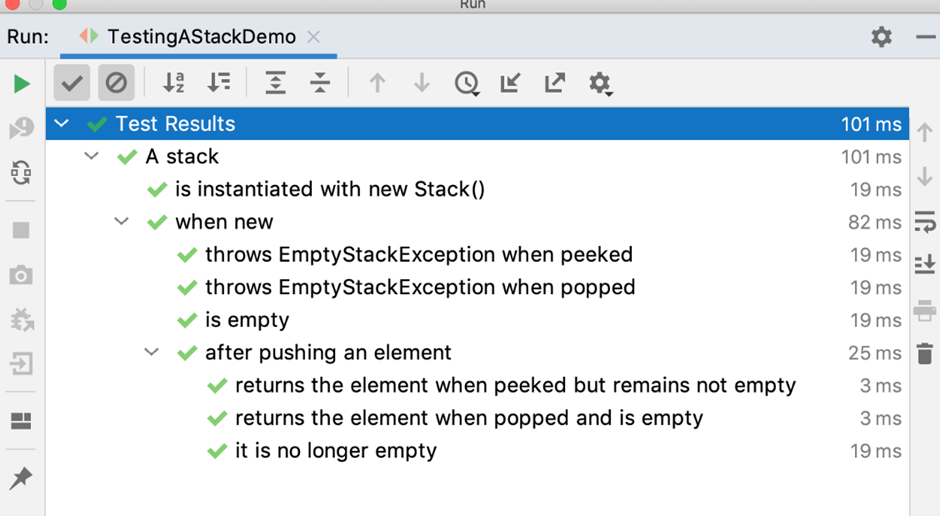
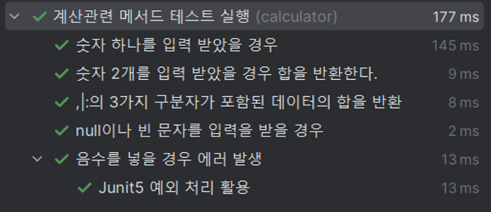
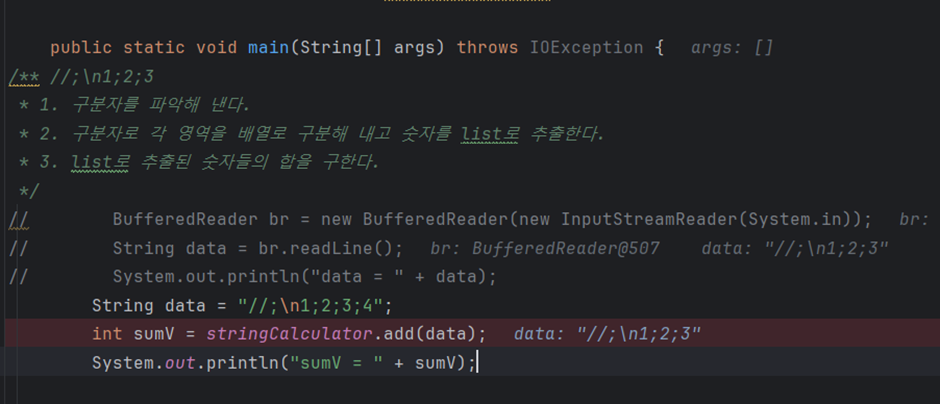
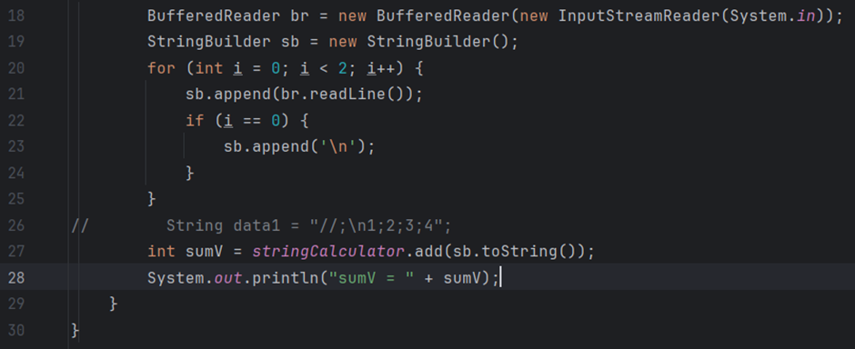
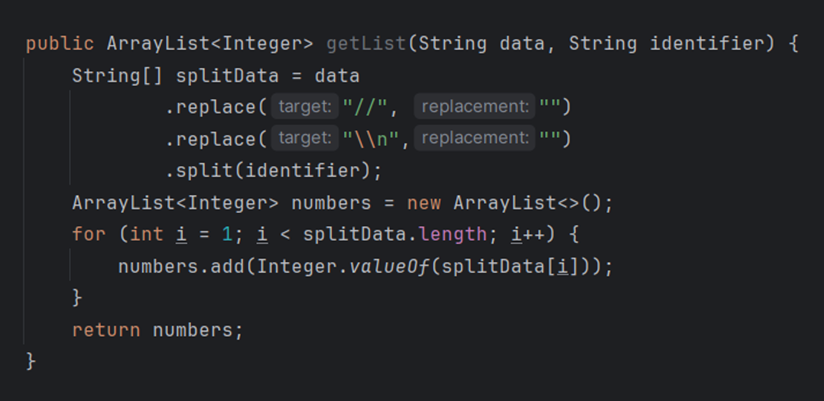
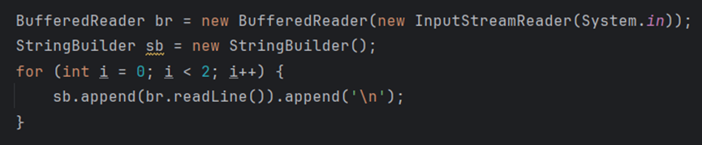
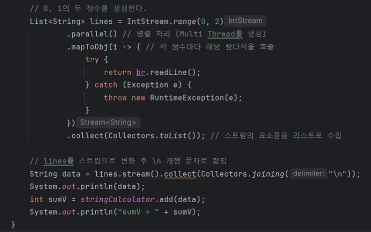
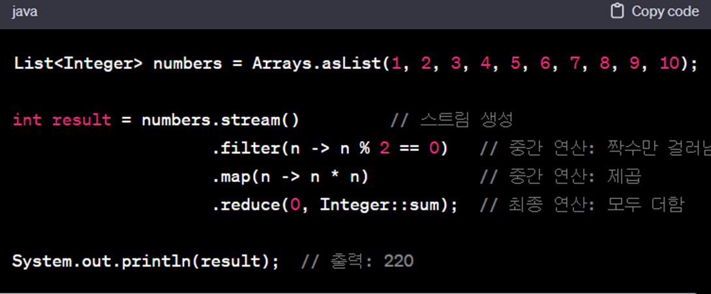

### 👨‍💻 Summary

- **테스트**
  - 가독성과 유지 보수성이 좋게 작은 기능 단위로 설계한다. (한글 사용도 Ok)
  - 프로덕션 코드와 분리하고, 동일한 구조를 활용해 테스트를 작성한다.
- **리팩토링**
  - 원칙을 세워서 그 기준으로 리팩토링을 진행한다.
  - 아주 작은 단위로 나누는 습관을 통해 재활용성과 유지 보수성을 높이자.
  - 구현 하고 나서 항상 리팩토링 할 부분이 없는지 찾아보는 습관을 들이자.

> 구현 → 테스트 → 리팩토링

---

### ✅ 테스트 코드를 더욱 가독성이 좋게 만들어주는 작업

- @Nest, @Display를 통해 공통 기능들을 묶고, 주석 대신 활용해본다.
  - 내가 작성했던 Test 코드들도 공통 주제에 대해서는 묶어서 테스트 코드를 작성한다면 어느 테스트에서 에러가 발생했는지 내용을 보다 쉽게 파악할 수 있고, 테스트의 문맥도 쉽게 파악이 가능하다.





https://junit.org/junit5/docs/current/user-guide/#writing-tests-nested


###  ✅ Given, when, then으로 영역을 나누어 테스트를 작성하면 가독성과 유지 보수성을 높일 수 있다.


###  ✅ 정규표현식의 개념

- 기존에는 정규 표현식 활용 대신 조건문과 반복문을 활용해 구분자를 추출해냈다. 데이터를 잘 다루기 위해서는 해당 내용도 공부할 필요성이 존재한다.

> 정규표현식이란?
> 프로그래밍에서 문자열을 다룰 때, 문자열의 일정한 패턴을 표현하는 일종의 형식 언어를 말한다. 정규식이라고도 부르며 보통 Regex라 많이 쓴다.


###  ✅ BufferedReader로 입력 받으면 에러가 발생합니다. 이유는?

```
Br.readLine()은 ‘\n’의 개행 문자를 기준으로 입력을 받아들인다. 그래서 \n을 입력하면 그것은 문자로 받아들이기 때문에 이스케이프 문자형태가 아니게 된다. 따라서 추가적으로 ‘\n’을 append해주는 방식으로 작성하였을 때 원하던 정답을 얻을 수 있었다.
```






###  ❓ 왜 저자는 else를 사용하지 않고 깊이 1단계를 유지하라고 하였는가?

- Else를 사용할 경우 어떤 조건이었는지 확인이 어렵고, 1단계를 유지하면 조금더 깔끔하고 복잡성이 낮은 코드를 유지할 수 있다.




###  ❓ 함수 표현식을 사용하는 것이 더 좋은가? 아니면 반복문을 활용하는 것이 좋은가?

- 반복문
  - 간단하고 명확한 로직
  - 코드가 직관적이고, 초보자들이 이해하기 쉬움
  - 더 명시적이고 강력한 제어 제공?!



- 스트림
  1. 함수형 프로그래밍 접근 방식을 취하고, 더 함수적이고 선언적이다.
  2. 람다 표현식을 통해 더 간결한 표현이 가능하다.
  3. 병렬 처리를 통해 성능을 향상시킬 수 있다.



- **스트림이란?**

  - 자바의 스트림(Stream)은 데이터를 처리하는데 사용되는 시퀀스(연속적인 요소)이다. 스트림은 데이터 소스를 추상화하고, 데이터를 다루는데 간편하고 효과적인 방법을 제공한다. 스트림은 데이터를 처리하는 연산들을 지원하며, 이를 활용해 간결하고 가독성 있는 코드를 작성할 수 있다.

- **특징**

  1. **원본 데이터 변경 없음**
     - 스트림은 원본 데이터를 변경하지 않고 새로운 스트림을 생성한다. 따라서 중간 연산과 최종 연산은 원본 데이터를 변경하지 않는다.

  2. **파이프 라인**
     - 스트림은 다수의 연산을 연결하여 파이프라인을 구성할 수 있다. 이를 통해 간결하면서도 유연한 데이터 처리를 가능하게 한다.

  3. **종류**
     - 주요 종류로는 기본 스트림(IntStream, LongStream, DoubleStream)과 객체 스트림이 있다.

  4. **중간 연산과 최종 연산**
     - 중간 연산은 스트림을 반환하며, 최종 연산은 스트림을 닫고 최종 결과를 반환한다. 중간 연산은 filter, amp, sorted 등이 있고, 최종 연산은 collect, forEach, reduce 등이 있다.

