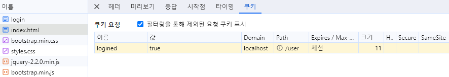
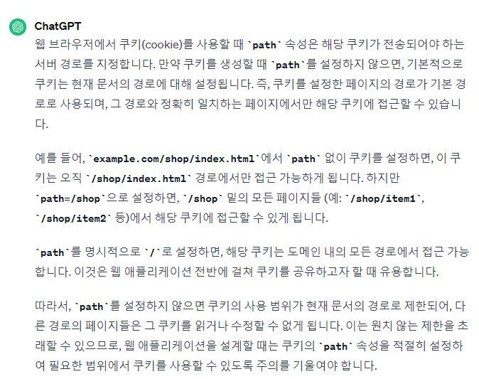
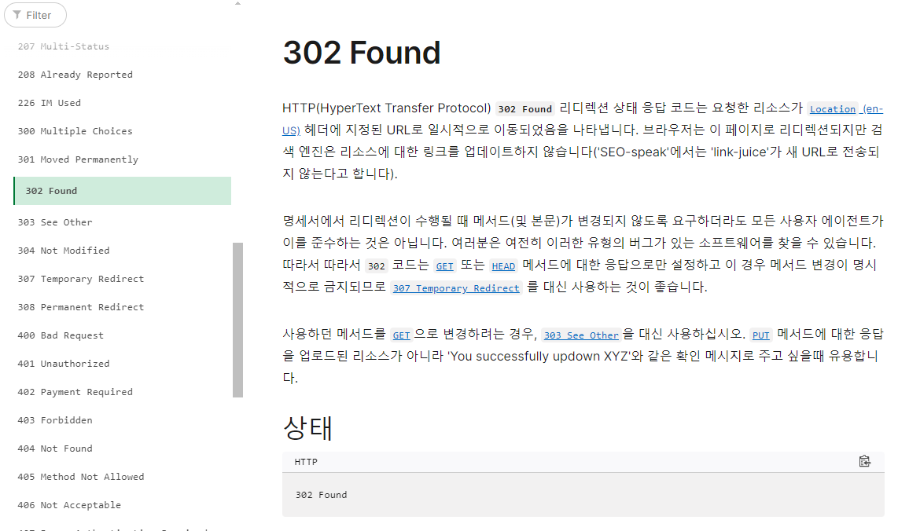

### ❓ 리팩토링

- 의미에 따라서 폴더를 만들어서 재구성 진행
  - Response
    - 응답에 대한 로직 구현

  - Service
    - url 요청에 따른 비즈니스 로직 구현

- `privat static final`을 통해 싱글톤 느낌으로 객체를 구현해서 사용했는데 이렇게 진행해도 괜찮은가?
- `static`으로 구현해서 `import`하는 방법이 나은가?

```java
public void run() {
        log.debug("New Client Connect! Connected IP : {}, Port : {}", connection.getInetAddress(),
                connection.getPort());

        try (InputStream in = connection.getInputStream(); OutputStream out = connection.getOutputStream()) {
            // TODO 사용자 요청에 대한 처리는 이 곳에 구현하면 된다.
            DataOutputStream dos = new DataOutputStream(out);

            byte[] body = "재배포 완료!!🥳".getBytes();

            BufferedReader br = new BufferedReader(new InputStreamReader(in, StandardCharsets.UTF_8));
            int contentLength = 0;

            // 첫 번째 Request 내용에서 type과 url 구분하기
            String content = br.readLine();
            log.debug("First line : {}", content);
            String[] tokens = content.split(" ");
            String type = tokens[0];
            String url = tokens[1];

            switch (type) {
                case "GET":
                    getGeneralRequest(content, br, url, body, dos);
                    break;
                case "POST":
                    if (url.equals("/user/login")) {
                        postLoginRequest(content, br, dos);
                    } else {
                        postRequest(content, contentLength, br, dos);
                    }
                    break;
                default:
                    break;
            }

        } catch (IOException e) {
            log.error(e.getMessage());
        }
    }

    private void postLoginRequest(String content, BufferedReader br, DataOutputStream dos) throws IOException {
        int contentLength = 0;
        while(true) {
            log.info("Input Data : {}", content);
            content = br.readLine();

            // Content-Length 추출
            if (content != null && content.contains("Content-Length")) {
                String[] tokens = content.split(" ");
                contentLength = Integer.parseInt(tokens[1]);
            }

            if (whileConditionCheck(content)) break;
        }

        Map<String, String> userData = new HashMap<>();
        String readData = IOUtils.readData(br, contentLength);
        String[] data = readData.split("&");
        Arrays.stream(data)
                .forEach(d -> {
                    String[] tokens = d.split("=");
                    userData.put(tokens[0], tokens[1]);
                });
        User user = DataBase.findUserById(userData.get("userId"));
        log.info("login form data: {}📌", readData);
        
        if (user == null || !user.getUserId().equals(userData.get("userId")) || !user.getPassword().equals(userData.get("password"))) {
            // 로그인 실패
            log.info("로그인 실패!!");
            byte[] body = Files.readAllBytes(new File("./webapp/user/login_failed.html").toPath());
            response401LoginFailHeader(dos, body.length);
            responseBody(dos, body);
        } else {
            // 로그인 성공
            // body에는 내용이 없어도 되나?
            byte[] body = Files.readAllBytes(new File("./webapp/index.html").toPath());
            response302LoginSuccessHeader(dos);
        }
    }
```

### ❓ 지역 변수

- Content-Length, type, url 처럼 여러 지역 변수가 생성되는데 이렇게 활용해도 괜찮은가?
  - 지역 변수를 null처럼 초기화로 설정해 두고 다른 로직을 진행해도 될까?

### ❓  302와 200 중복 응답

- 로그인 성공시 302로 index.html로 이동하게 하고, 200 Ok응답을 하고 싶어서 2가지 응답을 모두 사용
  - 결론적으로 302만 제대로 실행되고, 그 뒤의 것은 제대로 응답되지 않았다.
  - 일반적으로도 HTTP는 하나의 요청에 하나의 응답을 규칙으로 하고 있다.
- 🛠 4장에서 이에 대한 해답이 있었다.
  - 302로 요청을 보내면 클라이언트에서 Location 지정된 url로 한번 더 요청을 보내게 된다.
  - 즉, 302로 요청을 보내기만 하면 된다.


### ❓ 쿠키의 Path 설정

- 쿠키의 Path를 지정해주어 접근할 수 있는 범위를 설정해주어야 한다.
- Path를 따로 작성해주지 않아, Redirect할 때 쿠키가 필터링되어 사라지는 현상이 생겼다.
  - `/user`로 설정되면 `/user/**`의 경로에서는 해당 쿠키가 표시되었다.
    - 쿠키가 생겼다 사라지는 것을 보면서 마치 홍길동을 바라보는 느낌이었다.😥





### ✅ flush()

flush를 header와 body에 그냥 각각 사용했는데 찾아보니, 모두 함께 사용해야 했다.

- DataOutputStream의 버퍼에 있는 데이터를 전송
  1. 프로토콜 준수: HTTP 프로토콜은 응답의 헤더와 바디가 하나의 연속된 데이터 스트림으로 전송되는 것이 일반적이다.
  2. 성능: 버퍼링된 출력 스트림의 목적은 작은 데이터를 모아서 한 번에 전송해 네트워크의 효율성을 높이는 것이다.
  3. 데이터의 일관성: 헤더와 바디를 분리해서 전송하면, 네트워크의 오류나 타이밍 이슈로 둘 중 하나만 응답 받을 수 있다.


### ✅ 적절한 위치에 개행 문자가 필요

- 헤더의 마지막에 개행문자를 추가하지 않으면 html이 깨지고 쿠키가 제대로 저장되지 않았다.
  - 브라우저가 헤더의 내용과 바디의 내용을 제대로 파싱하지 못한다.

```java
private void response401LoginFailHeader(DataOutputStream dos, int lengthOfBodyContent) {
        try {
            dos.writeBytes("HTTP/1.1 401 Unauthorized \r\n");
            dos.writeBytes("Content-Type: text/html;charset=utf-8\r\n");
            dos.writeBytes("Content-Length: " + lengthOfBodyContent + "\r\n");
            dos.writeBytes("Set-Cookie: logined=false\r\n");
            //dos.writeBytes("\r\n");
        } catch (IOException e) {
            log.error(e.getMessage());
        }
    }
```

### ✅ 302의 상태 메세지는 Found

- 302의 리다이렉트 같은 경우 Ok가 아닌 Found를 사용해야 한다.
  - 하지만 비표준으로 사용해도 정상 작동이 되긴 했다.


```java
private void response302LoginSuccessHeader(DataOutputStream dos) {
        try {
            dos.writeBytes("HTTP/1.1 302 Found \r\n");
            dos.writeBytes("Content-Type: text/html;charset=utf-8\r\n");
            dos.writeBytes("Set-Cookie: logined=true\r\n");
            dos.writeBytes("Location: /index.html\r\n");
            dos.writeBytes("\r\n");
            dos.flush();
        } catch (IOException e) {
            log.error(e.getMessage());
        }
    }
```


