### 3장 내용 정리

### ✅ 유저 생성하고 권한 부여하기

- 현재 유저 전체 보기

```ubuntu
cat /etc/passwd
```

- 유저 아이디만 확인하기

```
cut -f1 -d: /etc/passwd
```

- `USERADD` 를 통해 등록된 계정만 보기

```
grep /bin/bash /etc/passwd
```


- 아이디만 확인하기

```
grep /bin/bash /etc/passwd | cut -f1 -d:
```


- 계정 생성하기
  - 비밀번호와 기타 정보들을 입력한다.

```
sudo adduser 아이디
```


- 계정 삭제하기

```
sudo deluser 아이디
```


- 계정 전환하기

```
su 아이디
```


- 비밀번호 생성

  - EC2에 private key로 접근해서 ubuntu와 root에 비밀번호가 존재하지 않는다.
  - 아래 명령어를 통해 비밀번호 부여하기

  ```
  sudo passwd 아이디
  ```

- 권한 부여하기

  - 권한 없이 접근하려고 하면 다음과 같은 에러가 발생한다.

    - /etc/sudoers에 해당 계정이 포함되어 있지 않아 에러 발생

    

```
// root로 계정 이동
su root
// vi모드로 sudoers 파일 열기
vi /etc/sudoers
```

- User권한 정보란에 아이디를 추가한다.


- 제대로 권한 부여되었는지 테스트 했을 때 정상 동작함


### ✅ 계정별로 UTF-8 인코딩 설정

- locale(언어 및 지역 설정)

```
sudo locale-gen ko_KR.EUC-KR ko_KR.UTF-8
```

- 명령어 의미
  - `sudo`: 관리자 권한으로 명령어 실행
  - `locale-gen`: 로케일 생성
  - `ko_KR.EUC-KR`: 한국어 로케일을 EUC-KR 문자 인코딩으로 생성. EUC-KR은 한국어 문자를 인코딩하는 방식 중 하나.
  - `ko_KR.UTF-8`: 한국어 로케일을 UTF-8 문자 인코딩으로 생성. UTF-8은 유니코드 문자를 인코딩하는 표준 방식 중 하나.


- 다국어 지원 및 우선 순위 설정

```
LANGUAGE="ko_KR:ko:en_US:en"
```

> 한국어 환경을 가장 우선적으로 선택되고 만약 사용할 수 없는 경우, 한국어(일반), 둘 다 안된다면 미국 영어가 선택된다는 의미

- 설정한 내용 반영
  - `source.profile` 명령어는 현재 사용자의 프로파일 파일을 실행하여 해당 환경 변수 및 설정을 현재 셸 세션에 적용하는 역할. 프로파일 파일은 사용자의 로그인 시에 실행되는 스크립트로, 사용자의 환경 설정을 초기화하거나 변경하는 데 사용된다.
  - `.profile` 파일은 주로 유닉스 계열의 운영체제에 사용되며, 사용자가 로그인할 때마다 실행된다. 이 파일에는 사용자의 환경 변수, PATH 설정, 셸 옵션 등이 정의될 수 있다.

```
source .profile
```

- 환경 변수 출력

```
env
```

> 선택적으로 환경 변수를 보고 싶으면 `env | grep LANG` 처럼 입력하면 된다.
> `|` 명령어는 파이프라인으로 명령어들을 연결하여 하나의 명령어의 출력을 다른 명령어의 입력으로 전달하는데 사용된다.
> `grep`은 주어진 텍스트에서 패턴을 검색하는 명령어


### ✅ JDK 다운받기

❓ 아래 부분은 잘 실행이 안됨.

---

```
sudo wget https://download.java.net/java/GA/jdk17.0.1/2a2082e5a09d4267845be086888add4f/12/GPL/openjdk-17.0.1_linux-x64_bin.tar.gz
```


- 압축풀기
  - tar.gz 압축 풀기

```
sudo tar -zxvf openjdk-17.0.1_linux-x64_bin.tar.gz jdk-17.0.1/
```

> - `.tar`: Tar는 여러 파일을 하나의 아카이브 파일로 묶는 것을 의미. 테이프 아카이브의 약자. 파일을 묶는 것이지 압축을 하지 않는다.
> - `.gz(Gzip)`: Gzip은 파일을 압축하는 데 사용된다. Gzip으로 찹축됨.
> - `.tar.gz`는 파일을 압축하고 아카이빙하는 데 사용되는 파일 확장자이며 주로 리눅스 및 유닉스 시스템에서 사용되는 표준 아카이브 포맷 중 하나이다.
> - `-x`: 압축 해제, `-z`: Gzip 압축 해제, `-v`: 상세한 출력

---

```
sudo apt-get update
sudo apt-get upgrade

// 설치 가능한 OpenJDK 검색
sudo apt search openjdk

// open jdk 설치
sudo apt-get install openjdk-17-jdk

// java 경로 확인
readlink -f $(which java)

sudo vi .profile
```


```
// 자바 경로 확인
echo $JAVA_HOME
// java 설치 확인
java -version
// java 컴파일러 버전 확인
javac -version
```

> `sudo apt-get update` 이 명령어는 패키지 목록을 업데이트한다. 패키지 목록은 시스템에 설치 가능한 소프트웨어 목록을 포함한다. 패키지 관리자는 최신 패키지 목록 정보를 인터넷으로부터 다운로드하고 로컬에 반영
> `sudo pat-get upgrade` 현재 설치된 패키지를 최신 버전으로 업그레이드한다. 시스템에 영향을 줄 수 있으므로 시스템을 백업하고 주의깊게 살펴봐야 한다.


### ✅ Gradle 설치

> 우선, 확인해 볼 것이 있다.
> root 및 유저 계정에서 Java와 관련된 Path를 모두 해지시켰지만 인식이 됐다.
> 확인해보니 profile이 환경 변수에 영향 주는 것 뿐만 아니라, /usr/bin에서도 시스템 기본 경로가 포함되어 있다. sudo apt-get install openjdk-17-jdk를 진행했기 때문에 자동적으로 기본 Path 환경 변수에 적용된 듯 하다.
> type java를 통해 어디 링크로부터 왔는지 출처를 알 수 있다.

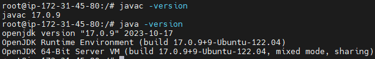

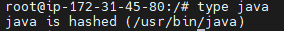

> sudo: superuser do의 약자로, 관리자 권한으로 명령어를 실행할 때 사용된다.
> apt-get은 Advanced Packaging Tool의 명령줄 인터페이스이다. Debian 및 Debian 기반 배포판에서 소프트웨어 패키지를 설치, 업데이트, 제거하는 데 사용된다. 패키지의 의존성을 자동으로 해결해준다.

```
sudo apt-get install gradle
```

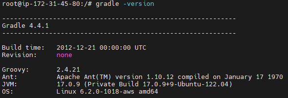

### ✅ 파일 및 폴더 삭제

```
sudo rm 파일명
sudo rm -r 폴더명
sudo rm -rf 비어있지 않은 폴더명
```

### ✅ 빌드하기

- [조건] Git을 우선 다운 받은 후 clone을 진행한다.
- 빌드 진행시 gradlew 파일이 실행할 수 있는 권한을 부여해야 한다.
  - `Permission denied` 에러가 발생했다.
  - `sudo`를 통해 빌드하는 것은 보안상 권장하지 않는다.

```
// gradlew 실행권한 부여
chmode +x ./gradlew
// gradlew 빌드진행
./gradlew clean build
```

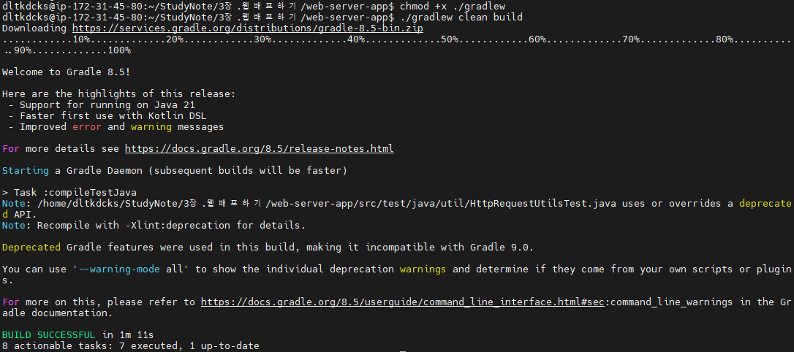

> `chmod` 는 change mode의 약자로, 파일이나 디렉토리의 권한을 변경하는 데 사용된다.
> `+x`는 실행 권한을 추가하라는 의미이다. execution을 나타내며 +는 추가, -는 권한을 제거하라는 의미이다.

### ✅ 권한 확인하기

`ls -l`, `ls -l 파일명` , `ll` 명령어를 통해 각 파일 및 디렉토리에 대한 권한, 크기, 마지막 수정 날짜 등을 알 수 있다.

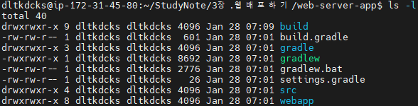

- 🐱‍👓 **화면에 표시되는 내용이 어떤 의미인지 확인하기(ChatGPT)**

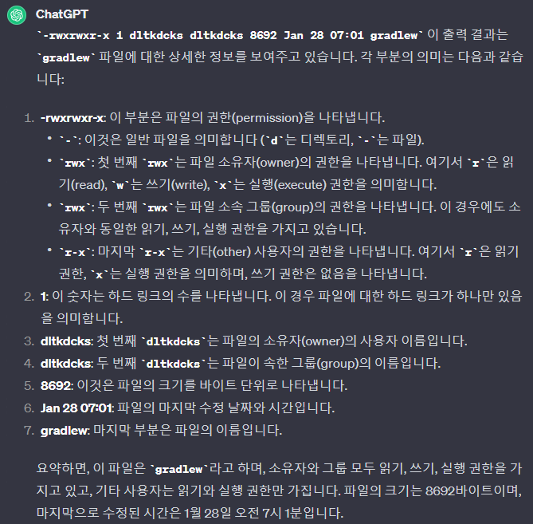

- 🐱‍👓 **사용자의 그룹은 무엇인가?(ChatGPT)**

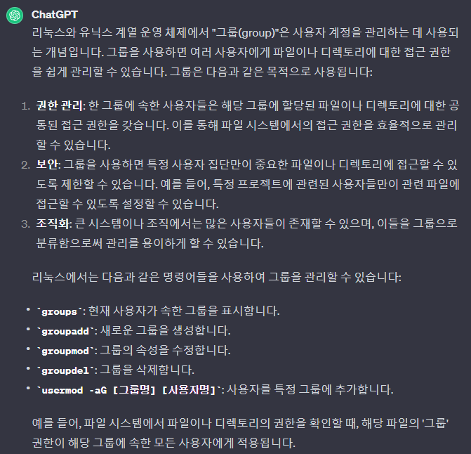

### ❓ 서버 실행하기

- 빌드된 서버 실행하기

  - `java -jar` 명령어 사용

  - 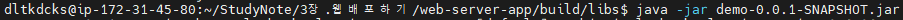

    - JAR파일을 직접 실행한다. JAR파일 내부의 `META-INF/MANIFEST.MF`파일에 지정된 메인 클래스가 자동으로 실행된다.
    - 클래스 패스는 JAR파일 내부와 매니페스트에 정의된 경로에 의해 결정된다.
    - JAR 파일이 모든 필요한 의존성을 포함하고 있다.
    - 추가 인자는 명령어 라인을 통해 전달할 수 있다.

  - 💥`java -cp` 명령어 사용 (에러 발생)

  - ```
    java -cp target/classes:target/dependency/* webserver.WebServer $PORT &
    ```

    - `-cp`는 `-classpath`를 의미하며 클래스 경로를 설정하는 역할을 한다.
    - `target/classes`와 `target/dependency/*` 디렉토리에 있는 모든 클래스와 라이브러리가 클래스 패스에 포함된다.
    - 실행하려는 메인 클래스를 명시적으로 지정해야한다.
    - 환경 변수나 추가 인자를 메인 클래스에 전달할 수 있다.(예: `$PORT`)

  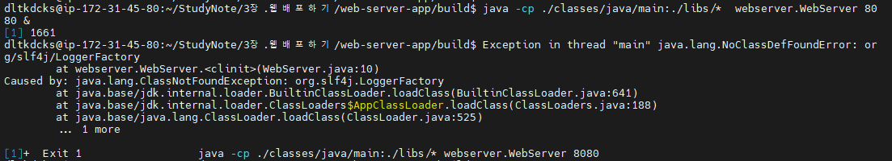

> `target/classes`: 보통 컴파일된 자바 클래스 파일들이 저장되는 위치이다.
> `target/dependency/*`: 프로젝트의 의존성이 저장된 디렉토리이다.
> `webserver.WebServer`: `webserver` 패키지 내의 `WebServer` 클래스의 `main` 메서드를 실행하라는 의미이다.
> `$PORT`: 해당 애플리케이션이 사용할 포트 번호를 지정
> `&`: 리눅스나 유닉스 시스템에서 사용되며, 해당 명령어는 백그라운드에서 실행하라는 의미이다. 즉, 명령어가 터미널과 독립적으로 실행되며, 터미널을 닫아도 프로그램이 계속 실행된다.


### ✅ 서버 접속하기

- AWS의 보안 탭에서 아래와 같이 HTTP 및 HTTPS로 접근하는 포트를 제한할 수 있다.
  - 사용자 지정 TCP 유형을 통해 8080 포트를 열어주고 실행해준다.

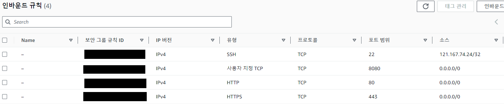


### ✅ 프로세스 킬하기

- 현재 실행 중인 프로세스를 찾는 명령어는 `ps -ef`이다.

- `ps -ef | grep webserver`는 현재 이를 찾는 명령어도 실행 중인 프로세스로 인식한다.

  - 매번 해당 명령어를 사용하면 PID가 새로 생성된다.

- `grep` 프로세스 자체 제외하는 방법은 아래와 같다

  - `ps -ef | grep webserver | grep -v grep`
    - `grep` 결과에서 `grep`이라는 단어를 포함하는 줄을 제외하게 한다.

  - `ps -ef | pgrep webserver`에서 `pgrep`은 `grep`과 함께 나타나는 명령을 제외하고 보여준다.


### ✅ 소스코드 재배포

- Hello World 부분을 다른 출력 내용을 변환하여 push한 후 다시 원격 서버에 빌드하여 실행하기
  - `git pull`을 진행할 때 각각의 커밋이 겹쳐서 에러가 발생했다.
  - `git pull --no-rebase`로 서로 Merge를 진행하였다.
    - 서로 다른 클래스를 수정하였기 때문에 충돌발생 가능성이 없어서 해당 명령어 사용

> 에러 내용
> 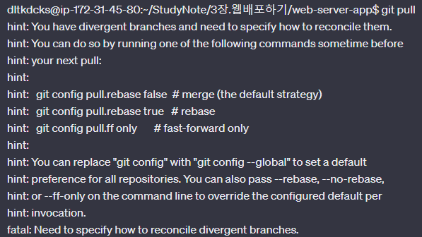

- 실행결과

  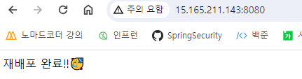