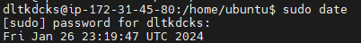

### 3장 내용 정리

### ✅ 유저 생성하고 권한 부여하기

- 현재 유저 전체 보기

```ubuntu
cat /etc/passwd
```

- 유저 아이디만 확인하기

```
cut -f1 -d: /etc/passwd
```

- `USERADD` 를 통해 등록된 계정만 보기

```
grep /bin/bash /etc/passwd
```


- 아이디만 확인하기

```
grep /bin/bash /etc/passwd | cut -f1 -d:
```


- 계정 생성하기
  - 비밀번호와 기타 정보들을 입력한다.

```
sudo adduser 아이디
```


- 계정 삭제하기

```
sudo deluser 아이디
```


- 계정 전환하기

```
su 아이디
```


- 비밀번호 생성

  - EC2에 private key로 접근해서 ubuntu와 root에 비밀번호가 존재하지 않는다.
  - 아래 명령어를 통해 비밀번호 부여하기

  ```
  sudo passwd 아이디
  ```

- 권한 부여하기

  - 권한 없이 접근하려고 하면 다음과 같은 에러가 발생한다.

    - /etc/sudoers에 해당 계정이 포함되어 있지 않아 에러 발생

    

```
// root로 계정 이동
su root
// vi모드로 sudoers 파일 열기
vi /etc/sudoers
```

- User권한 정보란에 아이디를 추가한다.


- 제대로 권한 부여되었는지 테스트 했을 때 정상 동작함



### ✅ 계정별로 UTF-8 인코딩 설정

- locale(언어 및 지역 설정)

```
sudo locale-gen ko_KR.EUC-KR ko_KR.UTF-8
```

- 명령어 의미
  - `sudo`: 관리자 권한으로 명령어 실행
  - `locale-gen`: 로케일 생성
  - `ko_KR.EUC-KR`: 한국어 로케일을 EUC-KR 문자 인코딩으로 생성. EUC-KR은 한국어 문자를 인코딩하는 방식 중 하나.
  - `ko_KR.UTF-8`: 한국어 로케일을 UTF-8 문자 인코딩으로 생성. UTF-8은 유니코드 문자를 인코딩하는 표준 방식 중 하나.


- 다국어 지원 및 우선 순위 설정

```
LANGUAGE="ko_KR:ko:en_US:en"
```

> 한국어 환경을 가장 우선적으로 선택되고 만약 사용할 수 없는 경우, 한국어(일반), 둘 다 안된다면 미국 영어가 선택된다는 의미

- 설정한 내용 반영
  - `source.profile` 명령어는 현재 사용자의 프로파일 파일을 실행하여 해당 환경 변수 및 설정을 현재 셸 세션에 적용하는 역할. 프로파일 파일은 사용자의 로그인 시에 실행되는 스크립트로, 사용자의 환경 설정을 초기화하거나 변경하는 데 사용된다.
  - `.profile` 파일은 주로 유닉스 계열의 운영체제에 사용되며, 사용자가 로그인할 때마다 실행된다. 이 파일에는 사용자의 환경 변수, PATH 설정, 셸 옵션 등이 정의될 수 있다.

```
source .profile
```

- 환경 변수 출력

```
env
```

> 선택적으로 환경 변수를 보고 싶으면 `env | grep LANG` 처럼 입력하면 된다.
> `|` 명령어는 파이프라인으로 명령어들을 연결하여 하나의 명령어의 출력을 다른 명령어의 입력으로 전달하는데 사용된다.
> `grep`은 주어진 텍스트에서 패턴을 검색하는 명령어


### ✅ JDK 다운받기

❓ 아래 부분은 잘 실행이 안됨.

---

```
sudo wget https://download.java.net/java/GA/jdk17.0.1/2a2082e5a09d4267845be086888add4f/12/GPL/openjdk-17.0.1_linux-x64_bin.tar.gz
```


- 압축풀기
  - tar.gz 압축 풀기

```
sudo tar -zxvf openjdk-17.0.1_linux-x64_bin.tar.gz jdk-17.0.1/
```

> - `.tar`: Tar는 여러 파일을 하나의 아카이브 파일로 묶는 것을 의미. 테이프 아카이브의 약자. 파일을 묶는 것이지 압축을 하지 않는다.
> - `.gz(Gzip)`: Gzip은 파일을 압축하는 데 사용된다. Gzip으로 찹축됨.
> - `.tar.gz`는 파일을 압축하고 아카이빙하는 데 사용되는 파일 확장자이며 주로 리눅스 및 유닉스 시스템에서 사용되는 표준 아카이브 포맷 중 하나이다.
> - `-x`: 압축 해제, `-z`: Gzip 압축 해제, `-v`: 상세한 출력

---

```
sudo apt-get update
sudo apt-get upgrade

// 설치 가능한 OpenJDK 검색
sudo apt search openjdk

// open jdk 설치
sudo apt-get install openjdk-17-jdk

// java 경로 확인
readlink -f $(which java)

sudo vi .profile
```


```
// 자바 경로 확인
echo $JAVA_HOME
// java 설치 확인
java -version
// java 컴파일러 버전 확인
javac -version
```

> `sudo apt-get update` 이 명령어는 패키지 목록을 업데이트한다. 패키지 목록은 시스템에 설치 가능한 소프트웨어 목록을 포함한다. 패키지 관리자는 최신 패키지 목록 정보를 인터넷으로부터 다운로드하고 로컬에 반영
> `sudo pat-get upgrade` 현재 설치된 패키지를 최신 버전으로 업그레이드한다. 시스템에 영향을 줄 수 있으므로 시스템을 백업하고 주의깊게 살펴봐야 한다.