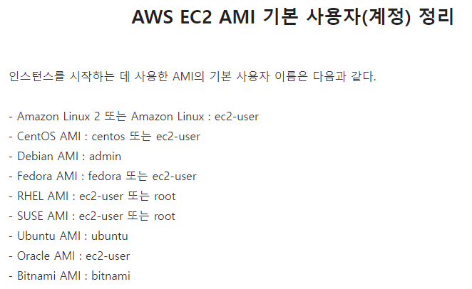
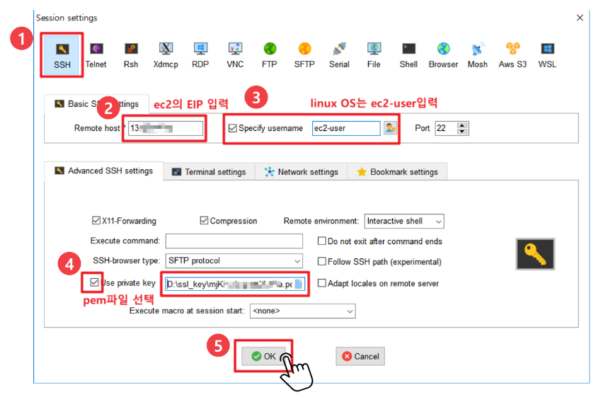

# AWS에 서버 배포하기

### ✔ 회원가입

- 신용카드를 입력해야 가입이 가능하다
  - 해킹을 당하게 되면 엄청난 과금이 부과될 수 있기 때문에 유의해야 한다.
  - 이메일을 설정하고, 비밀번호를 어렵게 구성한다.

### ✔ 2단계 인증(MFA)

- MFA(Mulit-Factor Authentication)
  - 대부분의 사람은 같은 비밀번호를 사용하는 경우가 많아서 다른 사이트에서 해킹을 당할 경우 AWS 계정도 해킹 당할 확률이 높다.
  - 2단계 인증을 통해 해킹 방지를 한다.
  - 인증관리자앱(Google-Authenticator)를 활용해서 MFA TOTP를 활용한다.
  - 디바이스 연결 후에는 MFA 코드를 통해 로그인이 가능하다.

> 참고: https://www.lainyzine.com/ko/article/how-to-enable-multi-factor-authentication-on-amazon-web-service/

### ✔ 지역 및 가용 영역

- 네트워크가 멀수록 경유지가 많아지고 그만큼 병목 현상이 생겨 응답속도가 느려진다.
  - 대한민국은 2016년에 AWS가 생겼다.
  - 지역마다 가격이 다르다
  - 서비스하는 지역이 다르면 더 빠른 서비스를 지원할 수 있도록 지역을 선정해야 한다.
  - https://www.cloudping.info/ 사이트에서 아마존 웹 서비스의 지역마다의 통신 속도를 측정해준다.

- AZ(Availability Zone)
  - 하나의 지역에는 여러 개의 건물들로 구성되어 있고 네트워크가 전용선으로 이루어져 있다.
  - 재난이나 장애가 발생했을 경우 빠른 복구가 가능하다.
  - 빠르게 데이터를 이전 하고 복구할 수 있다.
  - 같은 가용성 영역 내에서는 동일한 데이터를 활용할 수 있다.

### ✔ 루트 유저와 IAM 유저

- 루트는 모든 권한을 가진 계정이다
  - 해킹이 된다면, 아주 비싼 컴퓨터로 악의적인 사용이 가능하다.
- IAM(Identity and Access Management)는 AWS 리소스에 대한 액세스를 안전하게 제어할 수 있는 웹 서비스이다.
  - 장점
    - AWS 계정의 공유 액세스
      - IAM 증명서로 사용자들은 Root Account를 몰라도 서로 공유하는 인스턴스에 접근할 수 있다.
    - 세분화된 권한
      - 여러 리소스에 접근할 수 있는 권한을 서로 다르게 줄 수도 있다.
    - 무료
      - 각각의 접근 권한을 나누는 기능은 무료이다.

### ✔ IAM Identity Center 활용

- Root 아이디로 로그인하는 것은 권장하지 않는다.
- AdministratorAcess는 아래 3가지를 제외하고 Root와 거의 동일한 권한을 가진다
  - Billing 확인
  - IAM 관리자 유저 생성
  - IAM 관리자 유저 삭제
- PowerUserAccess 권한을 활용하였다.
  - IAM 권한이 없다
    - User 생성이나 또 다른 AdministratorAccess권한을 부여할 수 없다.
  - AWS EC2나 AWS ECS서비스에 들어가서 서버를 내리거나 RDS에 들어가서 DB를 지우는 악용만 가능

### ✔EC2(Elastic Compute Cloud)

- EC2는 독립된 컴퓨터를 임대해주는 서비스이다.
  - 범용적이고 가장 먼저 만들어진 서비스이다.
  - 컴퓨터 한 대가 인스턴스 하나

- 인스턴스 만들기💻
  - 시작 인스턴스를 누른다
  - 무료 버전인 프리티어 사양을 찾아서 클릭
  - 보안 이름을 변경하고 설정 추가를 해서 HTTP를 넣어준다.
  - 키 페어도 입력해서 하나 생성해준다
    - 입력된 내용을 바탕으로 RSA 키 페어 생성

- 리눅스의 배포판 중에 아마존 웹서비스에 최적화한 Amazon Linux를 제공한다.
  - 1년동안 무료로 사용할 수 있다.
- 인스턴스 유형
  - 사양을 결정한다
  - m은 메모리를 강점, c는 CPU의 강점 등등으로 생각하면 된다.
- 가격 설정
  - 예약 인스턴스는 선결제를 통해 할인 정책을 25%~75%까지 받을 수 있다.
  - 온디맨디드는 EC2를 켜고 끌 수 있다.
  - 스팟 인스턴스는 아마존 인프라에서 사용되지 않는 부분이 많을 때 아주 저렴해지고 반대는 비싸진다. 가격이 유동적으로 변한다.

- 설정
  - 스팟 인스턴스를 설정할 수 있다.
  - 종료 동작을 중지로 하면 저장 장치에 대한 요금만 지불되고, 종료는 인스턴스가 삭제된다.
  - CloudWatch 모니터링 설정 가능(CPU, Memory 점유율 확인 등) 

- 스토리지 구성

  - 운영체제에 따라 용량이 다르다.
    - 리눅스는 8GB, 윈도우는 30GB이다.
  - EBS는 Elastic Block Stroe의 약자이다.(대규모 고성능 블록 스토리지)
    - 장애 보호 및 가용 영역의 복제로 고가용성을 제공

  - Provisioned IOPS 저장 장치의 속도를 변경할 수 있는 옵션

- 이름 및 태그
  - EC2에 대한 정보를 추가 기입할 수 있다.

- 보안

  - ssh(Secure shell)
    - 리눅스나 유닉스 계열의 EC2에 접근하기 위한 원격 제어의 방식
    - Anywhere은 어디서나 접속
    - MyIp는 우리 집에서만 접속 가능

  - HTTP
    - 웹 브라우저를 통해 접근 가능하게 함
  - RDP
    - 윈도우의 원격제어 방식

- 키 페어

  - 인스턴스에 접근하기 위한 암호화된 키
  - Key Pair 이름을 입력하고 키 페어를 생성하면 아마존에서 만든 랜덤한 암호화된 키 정보가 다운된다.
  - 비밀번호 탈취될 가능성이 존재한다.
  - 잃어버리면 다시는 되찾을 수 없다.

- 탄력적 IP 할당하기
  - 보통 인스턴스는 중지했다가 다시 시작하면 IP가 바뀌는데 이를 고정시켜준다.
  - 왼쪽 네트워크 및 보안 메뉴의 탄력적 IP로 들어가서 탄력적 IP 주소 할당을 클릭
  - 할당 후 EC2 주소와 연결하는 과정 진행

> 탄력적 IP 생성 및 연결: https://soobarkbar.tistory.com/224

### ✔EC2원격 연결

- SSH Client의 종류에는 Putty, Mobaxterm이 있는데, GUI도 제공해주는 Mobaxterm을 사용해보자.

> 사용법: https://minjii-ya.tistory.com/23

- ubuntu의 경우 username이 ubuntu였다..
  - ec2-user를 계속 입력해서 에러 발생함.

