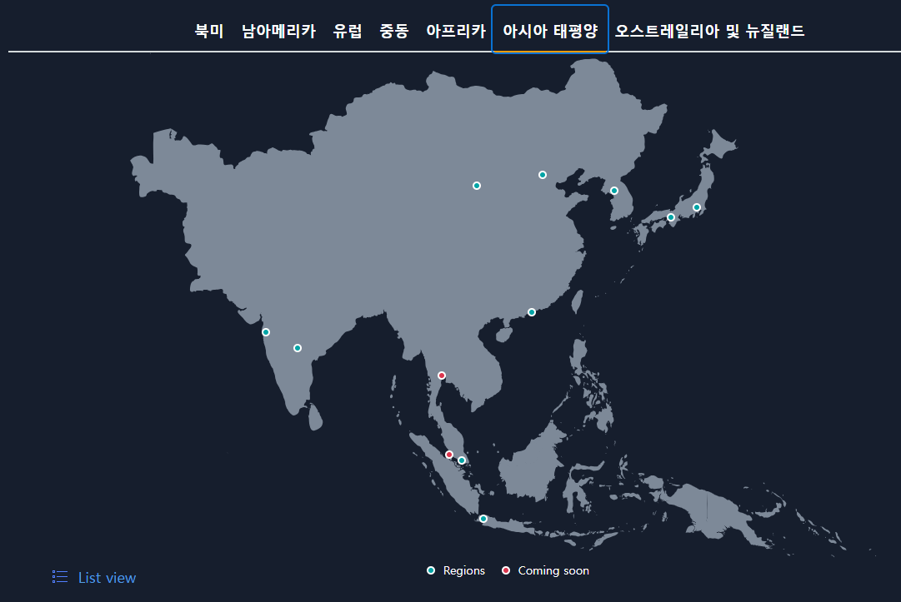
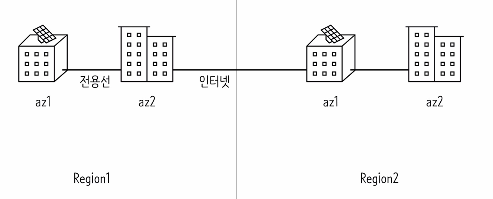
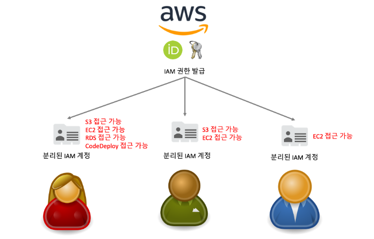

# AWS에 서버 배포하기

### ✔ 회원가입

- 신용카드를 입력해야 가입이 가능하다
  - 해킹을 당하게 되면 엄청난 과금이 부과될 수 있기 때문에 유의해야 한다.
  - 이메일을 설정하고, 비밀번호를 어렵게 구성한다.

### ✔ 2단계 인증(MFA)

- MFA(Mulit-Factor Authentication)
  - 대부분의 사람은 같은 비밀번호를 사용하는 경우가 많아서 다른 사이트에서 해킹을 당할 경우 AWS 계정도 해킹 당할 확률이 높다.
  - 2단계 인증을 통해 해킹 방지를 한다.
  - 인증관리자앱(Google-Authenticator)를 활용해서 MFA TOTP를 활용한다.
  - 디바이스 연결 후에는 MFA 코드를 통해 로그인이 가능하다.

> 참고: https://www.lainyzine.com/ko/article/how-to-enable-multi-factor-authentication-on-amazon-web-service/

### ✔ 지역 및 가용 영역

- 네트워크가 멀수록 경유지가 많아지고 그만큼 병목 현상이 생겨 응답속도가 느려진다.
  - 대한민국은 2016년에 AWS가 생겼다.
  - 지역마다 가격이 다르다
  - 서비스하는 지역이 다르면 더 빠른 서비스를 지원할 수 있도록 지역을 선정해야 한다.
  - https://www.cloudping.info/ 사이트에서 아마존 웹 서비스의 지역마다의 통신 속도를 측정해준다.

- AZ(Availability Zone)
  - 하나의 지역에는 여러 개의 건물들로 구성되어 있고 네트워크가 전용선으로 이루어져 있다.
  - 재난이나 장애가 발생했을 경우 빠른 복구가 가능하다.
  - 빠르게 데이터를 이전 하고 복구할 수 있다.
  - 같은 가용성 영역 내에서는 동일한 데이터를 활용할 수 있다.

### ✔ 루트 유저와 IAM 유저

- 루트는 모든 권한을 가진 계정이다
  - 해킹이 된다면, 아주 비싼 컴퓨터로 악의적인 사용이 가능하다.
- IAM(Identity and Access Management)는 AWS 리소스에 대한 액세스를 안전하게 제어할 수 있는 웹 서비스이다.
  - 장점
    - AWS 계정의 공유 액세스
      - IAM 증명서로 사용자들은 Root Account를 몰라도 서로 공유하는 인스턴스에 접근할 수 있다.
    - 세분화된 권한
      - 여러 리소스에 접근할 수 있는 권한을 서로 다르게 줄 수도 있다.
    - 무료
      - 각각의 접근 권한을 나누는 기능은 무료이다.

### ✔ IAM Identity Center 활용

- Root 아이디로 로그인하는 것은 권장하지 않는다.
- AdministratorAcess는 아래 3가지를 제외하고 Root와 거의 동일한 권한을 가진다
  - Billing 확인
  - IAM 관리자 유저 생성
  - IAM 관리자 유저 삭제
- PowerUserAccess 권한을 활용하였다.
  - IAM 권한이 없다
    - User 생성이나 또 다른 AdministratorAccess권한을 부여할 수 없다.
  - AWS EC2나 AWS ECS서비스에 들어가서 서버를 내리거나 RDS에 들어가서 DB를 지우는 악용만 가능

### ✔EC2(Elastic Compute Cloud)

- EC2는 독립된 컴퓨터를 임대해주는 서비스이다.