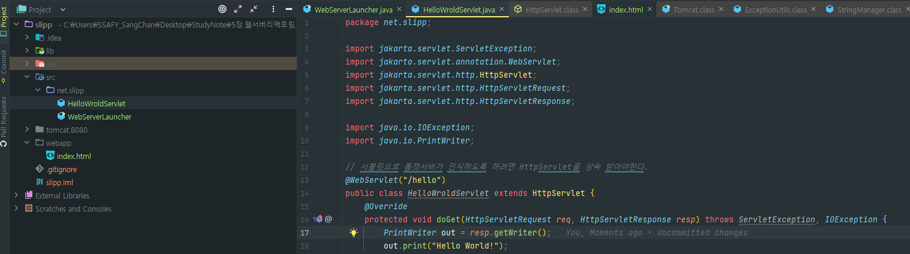

### 📌 Summary

- 리팩토링
  - 코드 재사용성과 가독성, 유지 보수성을 향상시킨다.
  - 메서드와 클래스 단위로 나누면서 테스트를 더욱 용이하게 만든다.
  - 개발자의 실수를 줄이고, 코드의 논리적 흐름을 나타내기가 수월해진다.
- 서블릿
  - 요청과 응답에 대한 처리들을 대신해줘서 비지니스 로직에 집중할 수 있게 도와준다.
  - Tomcat, Jetty같은 서블릿 컨테이너들이 서블릿의 생명주기를 관리하고 도와준다는 것을 알 수 있었다.
  - 스프링 부트에서도 Embedded Tomcat을 기본적으로 제공하므로 이런 서블릿을 의식하지 않고 편하게 사용할 수 있다는 장점이 있었다.
- 질문
  - 코드의 복잡성이 증가할 때 주석 단위로 메서드를 분리하는 것이 도움이 되는가?
    - 각 코드의 역할을 구별하고 테스트하기에 용이해질까?
  - Abstract와 Interface는 어느 상황에 사용하는 것이 좋을까?
    - Abstract 조금더 추상화된 Interface가 선호된다.
  - WAR와 JAR파일의 차이점은?

---

### ✅ 톰캣

- Embedded Tomcat
  - 다른 애플리케이션에 내장되어 있는 형태의 톰캣을 의미한다. 즉 내부에 포함되어 있어 애플리케이션을 실행할 때 함께 실행된다
  - 주로 Spring Boot와 같은 프레임워크나 서비스에 사용된다.
  - 애플리케이션을 패키징하고 배포할 때 톰캣 서버를 별도로 설치하거나 설정할 필요가 없으며, 애플리케이션 실행에 필요한 모든 것이 패키지에 포함된다.
- Core Tomcat
  - 코어 톰캣은 일반적인 톰캣 서버를 의미한다. 독립적으로 설치되고 실행된다.
  - 주로 서버 사이드 애플리케이션을 개발하고 배포할 때 사용한다.
  - WAR파일을 만들어 배포하거나, 톰캣 서버에 직접 애플리케이션을 배치하여 실행할 수 있다.

### ❓ Abstract vs Interface

- 사용 목적
  - Abstract: 공통된 기본 기능을 제공하고 상속받는 클래스들이 특정 메서드를 구현하도록 강제할 수 있다.
  - Interface: abstract보다 추상화된 개념으로 여러 클래스가 공통적으로 사용할 추상 메서드를 정의한다.
- 상속과 구현
  - Abstract: 단 하나의 추상 클래스를 상속 받을 수 있다.(extends 사용)
  - Interface: 여러 인터페이스로부터 상속 받을 수 있다.(implements 사용)
- 멤버 타입
  - Abstract: 추상 메서드 뿐만 아니라 일반 메서드, 필드, 생성자도 포함할 수 있다.
  - Interface: 오직 추상 메서드와 상수만 포함할 수 있다. Java8이후 default와 static 메서드도 포함할 수 있게 되었다.
- 접근 제어자
  - Abstract: public, protecte, private 접근 제어자를 사용할 수 있다.
  - Interface: Java9이전에는 모든 메서드가 public이었다. Java9 이후, private 메서드도 정의가 가능해졌다.

### ❓ WAR vs JAR


### ✅ Embedded Tomcat 실행하기

- Tomcat 홈페이지에서 embedded용으로 zip파일을 다운하고 압축을 푼다.
- jar파일들을 애플리케이션 내부로 이동시키고 classpath를 설정하여 jar파일을 인식할 수 있게 한다.


- 그 후 아래와 같이 main 메서드 생성 후 서버를 실행시키면 톰캣을 실행시킬 수 있다.

  - webapp폴더를 root로 지정하기 때문에 해당 경로에 폴더를 생성해주어야 한다.
    - 테스트용으로 index.html을 만들었는데, 기본적으로 톰캣은 `index.html`을 기본값으로 인식한다.

  

```java
package net.slipp;

import org.apache.catalina.LifecycleException;
import org.apache.catalina.connector.Connector;
import org.apache.catalina.startup.Tomcat;

import java.io.File;

public class WebServerLauncher {
    public static void main(String[] args) {
        String webappDirLocation = "webapp/";
        Tomcat tomcat = new Tomcat();
        String webPort = System.getenv("PORT");
        if (webPort == null || webPort.isEmpty()) {
            webPort = "8080";
        }
        tomcat.setPort(Integer.valueOf(webPort));
        Connector connector = tomcat.getConnector();
        connector.setURIEncoding("UTF-8");
        // root로 인식시킨다.
        tomcat.addWebapp("/", new File(webappDirLocation).getAbsolutePath());
        System.out.println("configuring app with basedir: "
        + new File("./" + webappDirLocation).getAbsolutePath());
        try {
            tomcat.start();
        } catch (LifecycleException e) {
            e.printStackTrace();
        }
        tomcat.getServer().await();
    }
}
```

### ✅ 서블릿으로 Hello World 출력하기

- 아래와 같이 서블릿을 구성할 수 있다.(서블릿 표준 디렉토리를 맞춰줘야 한다.)
  - 하지만, 클래스 파일을 인식할 수 있는 기본 경로가 존재한다.
  - webapp/WEB-INF/classes 밑에 자바 코드가 있어야 한다.

​	



- 우선 해당 경로를 폴더 구조를 통해 미리 만들어준다.
  - `slipp/webapp/WEB-INF/classes`
- Project Settings로 들어가서 Modules에서 output 경로를 내가 만든 디렉토리 구조에 맞게 변경시킨다.

