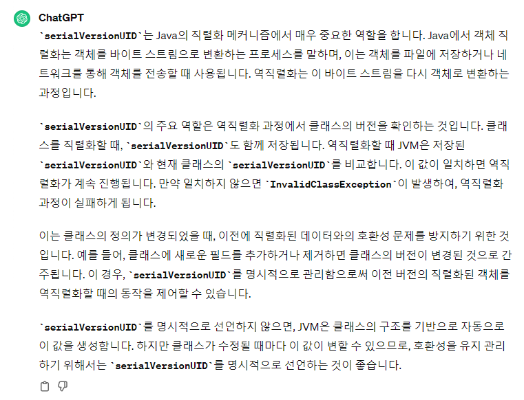
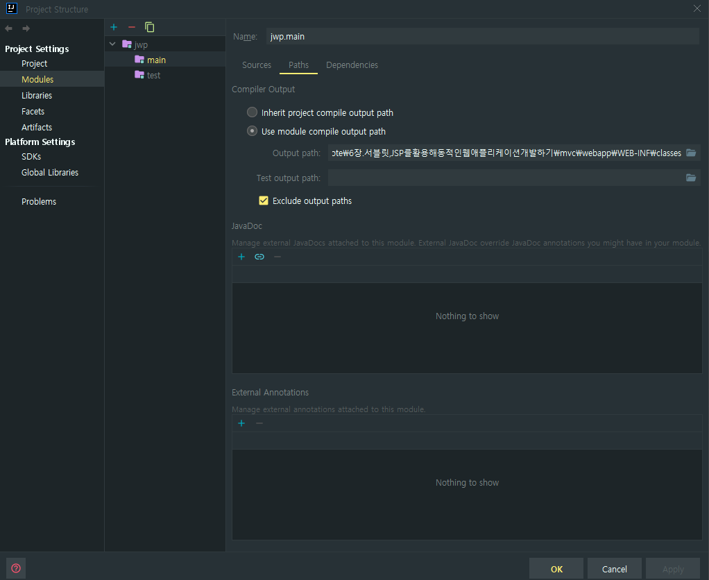
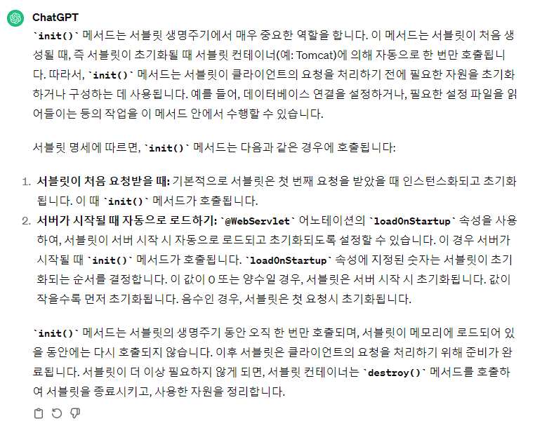

### ❓ css, js, 이미지와 같은 정적 파일은 어디서 처리되는가? (😥)

- 톰캣 내부의 default 서블릿으로 실행되는 것으로 추정
- log를 찍어보고 싶지만 로그가 출력되지 않는다

```java
@WebFilter("/*")
public class ResourceFilter implements Filter {
    private static final Logger logger = LoggerFactory.getLogger(ResourceFilter.class);
    private static final List<String> resourcePrefixs = new ArrayList<>();
    static {
        resourcePrefixs.add("/css");
        resourcePrefixs.add("/js");
        resourcePrefixs.add("/fonts");
        resourcePrefixs.add("/images");
        resourcePrefixs.add("/favicon.ico");
    }

    private RequestDispatcher defaultRequestDispatcher;

    @Override
    public void init(FilterConfig filterConfig) throws ServletException {
        logger.info("init❓❓");
        this.defaultRequestDispatcher = filterConfig.getServletContext().getNamedDispatcher("default");
    }

    @Override
    public void doFilter(ServletRequest request, ServletResponse response, FilterChain chain)
            throws IOException, ServletException {
        HttpServletRequest req = (HttpServletRequest) request;
        String path = req.getRequestURI().substring(req.getContextPath().length());
        logger.info("✅✅✅path: {}", path);
        if (isResourceUrl(path)) {
            logger.info("path : {}", path);
            defaultRequestDispatcher.forward(request, response);
        } else {
            chain.doFilter(request, response);
        }
    }

    private boolean isResourceUrl(String url) {
        for (String prefix : resourcePrefixs) {
            if (url.startsWith(prefix)) {
                return true;
            }
        }
        return false;
    }
    
    @Override
    public void destroy() {
    }
}
```

### ❓ serialVersionUID란? (😥)

- 클래스의 변경 내역을 확인하기 위해 사용한다.

- 실제로 사용하는가? 한다면 어떻게???




### ❓ WebServerLauncher 실행 시 자동으로 컴파일 되지 않는 문제 (😀 해결)

- Gradle은 자동으로 컴파일 후 실행시키는데 왜 안되지?
- 현재 Intellij IDE를 통해 Java를 컴파일 시키고 Run하고 있다.
- Project Structure에서 컴파일 되는 위치를 변경시키면 수정이 가능



### ❓  정적 자원 경로 문제 (😀 해결)

- 상대 경로
  - 아래와 같이 url의 제일 앞에 `/` 가 없으면 현재 페이지의 URL을 기준으로 상대 경로를 찾으려고 한다.
  - 즉 `/users/loginForm`페이지를 찾을 때 `/users/js/` 경로를 기반으로 찾게 되어 문제가 생긴다.
- 절대 경로
  - 이를 해결하기 위해 url에 `/`를 앞에 붙여줘서 해결해야 한다.
  - `<script src="/js/jquery-2.2.0.min.js"></script>`

```jsp
<%@ page contentType="text/html;charset=UTF-8" language="java" %>
<!-- script references -->
<script src="js/jquery-2.2.0.min.js"></script> // 틀린 경로
<script src="js/bootstrap.min.js"></script> // 틀린 경로
<script src="js/scripts.js"></script> // 틀린 경로
```


### ✅ HttpServlet의 init()메서드

- 기본적으로 서블릿이 첫 번째 요청 받았을 때 인스턴스화 및 초기화가 진행된다.
- `loadOnStartUp`속성을 사용하면 서버가 시작될 때 초기화가 일어난다.
  - 양의 값을 입력하여, 초기화되는 순서를 정할 수 있다.



