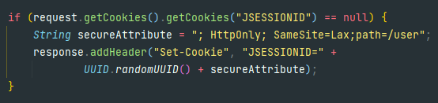
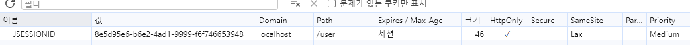
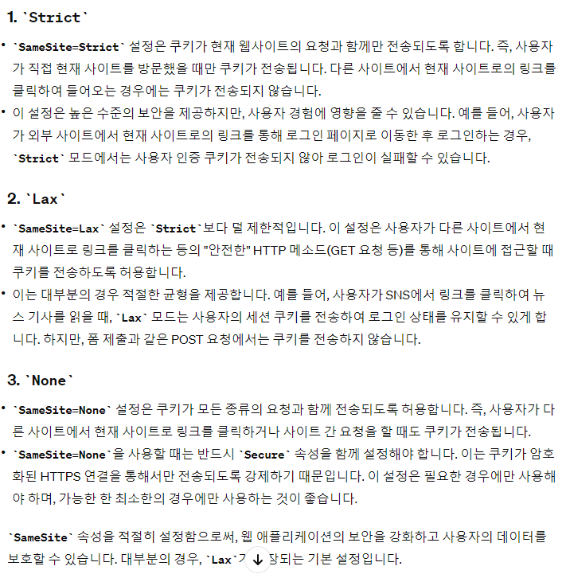

### ✅ 쿠키 보안 설정

- 세션으로는 보안적으로 불충분하다.
  - 세션 ID를 예측하지 못하도록 UUID를 활용
  - Cookie에 각종 보안을 적용
  - Https를 활용하면 더욱 좋다.

### ❓ SameSite란? Lax, Strict, None은 무엇인가?

SameSite 쿠기 속성은 웹 브라우저가 쿠키를 어떤 요청과 함께 보내야 하는지를 결정한다.

크로스사이트 요청 위조 (CSRF)공격을 방지하는데 유용하고, 쿠키가 다른 사이트의 요청에 의해 전송되는 방식을 제한한다.

