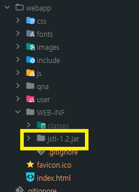
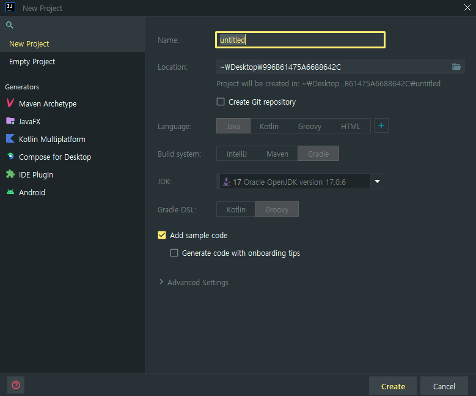

[TOC]

### 📌 JSTL 미인식 에러

- 직접 jstl라이브러리의 Jar파일을 webapp에 이동시켜주니 동작했다.



### ✅ Gradle기반의 Project 생성 방법

- New Project - java를 선택하면 Build 시스템을 Gradle로 할 수 있는 항목이 주어진다.



### ✅ Build 후 Complie된 파일들을 복사하거나 지우는  Gradle 로직

- classes는 Java 플러그인에 의해 추가되는 작업으로, 프로젝트의 메인 클래스와 리소스를 컴파일 하는 작업이다.
  - classes작업 완료 후 copyClassesToWebInfo작업이 실행되도록 설정함.(`finalizedBy`)
- 새로운 task(작업)을 정의하고 있다. Copy 타입은 파일이나 디렉토리를 복사하는 데 사용되는 Gradle 내장 작업 유형이다.

```groovy
task copyClassesToWebInfo(type: Copy) {
    from sourceSets.main.output
    into 'webapp/WEB-INF/classes'
}

classes.finalizedBy(copyClassesToWebInfo)

task cleanCustom(type: Delete) {
    delete 'webapp/WEB-INF/classes'
}

clean.finalizedBy(cleanCustom)
```

### ✅ Project를 Maven → Gradle로 변경 시 의존성 항목

```groovy
dependencies {
    // junit
    // 단위 테스트 프레임워크
    testImplementation 'junit:junit:4.11'
    // Java Servlet API
    // 서블릿 API는 Java EE 웹 어플리케이션을 개발하기 위한 필수 인터페이스와 클래스를 제공한다.
    // 이를 통해 클라이언트의 요청과 응답을 처리할 수 있다.
    implementation 'javax.servlet:javax.servlet-api:3.1.0'
    // JSTL
    // JavaServer Pages Standard Tag Library는 JSP에서 커스텀 태그를 사용할 수 있게 도와준다.
    // 코드를 더욱 간결하고 유지보수하기 쉽게 만들어준다.
    implementation 'javax.servlet:jstl:1.2'
    // guava
    // Google이 제공하는 자바 기반의 오픈소스 라이브러리이다.
    // 컬렉션, 캐싱, 프리미티브 지원, 병렬 스레드, 문자열 처리 등 다양한 유틸리티 기능을 제공한다.
    implementation 'com.google.guava:guava:18.0'
    // h2
    // 자바로 작성된 인메모리 데이터베이스이다. 개발 및 테스트 용도로 매우 유용하고,
    // 설정이 간단하고 속도가 빠르다.
    implementation 'com.h2database:h2:1.3.167'
    // Apache lang3
    // Java.lang API를 확장하는 유틸리티 클래스를 제공한다.
    // 문자열 조작, 숫자 조작, 시스템 속성, 날짜와 시간 조작 등의 기능을 포함한다.
    implementation 'org.apache.commons:commons-lang3:3.3.2'
    // Apache dbcp2
    // Database Connecton Pooling(DBCP)는 데이터베이스 연결 풀링 서비스를 제공한다.
    // 데이터베이스 연결을 효율적으로 관리하고, 성능을 개선하는 데 도움을 준다.
    implementation 'org.apache.commons:commons-dbcp2:2.1.1'
    // Spring jdbc
    // 데이터를 쉽게 액세스 하기위한 프레임워크
    implementation 'org.springframework:spring-jdbc:4.2.5.RELEASE'
    // Spring test
    // Spring Application의 테스트를 지원한다.
    implementation 'org.springframework:spring-test:4.2.5.RELEASE'
    // reflections
    // 런타임에 클래스, 필드, 메소드의 어노테이션 등을 스캔하고 쿼리할 수 있는 API를 제공
    // 동적으로 리소스를 찾거나, 타입 안정성을 제공하는 등의 기능을 가능하게 한다.
    implementation 'org.reflections:reflections:0.9.10'
    // logback-classic
    // loback은 SLF4J의 네이티브 구현으로, 로깅 시스템을 위한 프레임워크이다.
    // SLF4(Simple Loggin Facade for Java): 로깅의 추상화 계층을 제공
    implementation 'ch.qos.logback:logback-classic:1.1.2'
    // logback-core
    implementation 'ch.qos.logback:logback-core:1.1.2'
    // lombok
    // getter, setter, toString 메소드 등의 반복을 줄이기 위한 라이브러리이다.
    // 어노테이션을 통해 코드를 자동으로 생성해준다.
    compileOnly 'org.projectlombok:lombok:1.18.30'
    // jackson-databind
    // JSON을 자바 객체로 변환하거나, 그 반대로 변환할 수 있는 고성능 JSON 프로세서이다.
    implementation 'com.fasterxml.jackson.core:jackson-databind:2.4.4'
    // tomcat
    // tomcat-embed-core
    implementation 'org.apache.tomcat.embed:tomcat-embed-core:8.0.15'
    // tomcat-logging-juli
    implementation 'org.apache.tomcat.embed:tomcat-embed-logging-juli:8.0.15'
    // tomcat-embed-jasper
    // JSP를 서블릿으로 변환하는 컴파일러이다.
    implementation 'org.apache.tomcat.embed:tomcat-embed-jasper:8.0.15'

}
```

