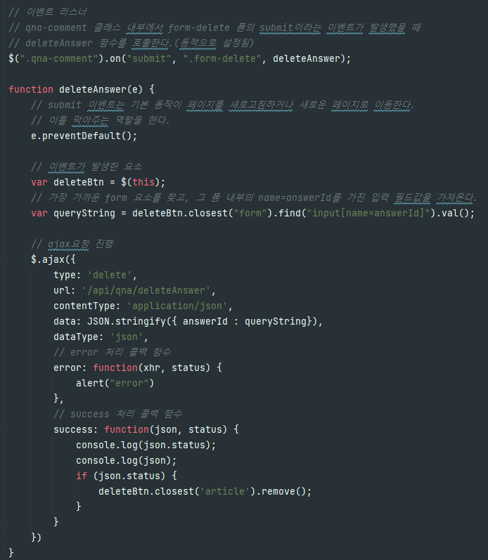
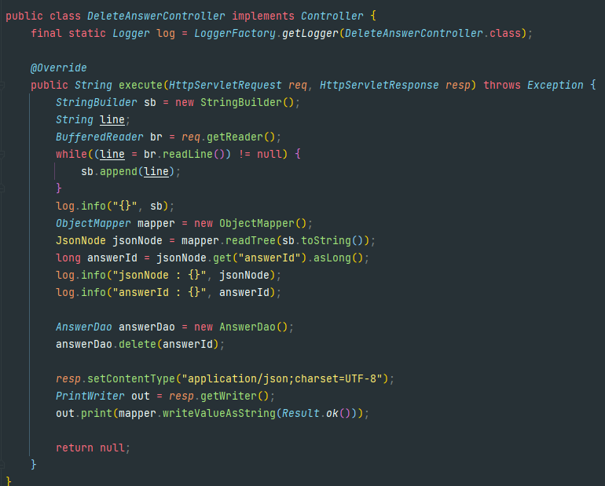
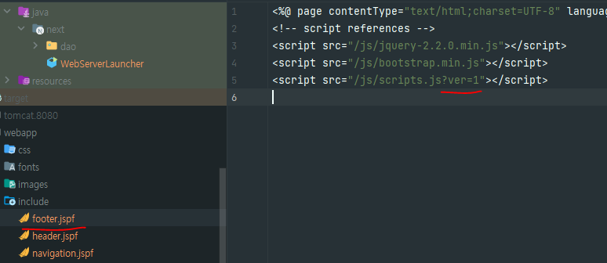
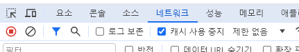
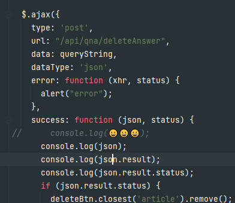

# Summary

### 📌 AJAX 사용법 학습, MVC 패턴 리팩토링

### AJAX

- AJAX 통신을 통해 동적으로 홈페이지를 갱신할 수 있다.
  - 페이지 새로고침이 필요없고 빠른 반응 시간으로 사용자의 경험이 크게 향상된다.
  - 일부만 수정하기 때문에 서버의 부하를 줄일 수 있다.
  - JQuery 라이브러리를 활용한다.
- 문제가 되는 코드를 컴파일 단에서 확인하기 힘들다.

### MVC

1. View 인터페이스를 활용해 JspView와 JsonView로 역할 분담(추상화)

   - Jsp는 해당 페이지를 응답하는 방식

   - Json은 단순 데이터만 전달하는 방식

   - if/else if/else를 활용하지 않은 객체지향 관점의 설계

2. ModelAndView를 통해 Model에 대한 추상화
   - ❓View와 함께 데이터를 넣어줄 Model을 한 곳에 묶어서 추상화 진행
     - MVC에서 M에 해당하는 것이 아닌 V를 위한 model인가?
   - view와 model값을 넣거나 뺄 수 있다.
   - ❓`AbstractController`를 하나 둠으로써 반복적인 ModelAndView 생성을 줄여준다.
     - 내가 이해한 부분이 맞는가?
   - ❓`ModelAndView`를 사용해서 좋은 점은???

---

### ❓ delete Http 메서드 사용

- delete로 바꾸면 데이터 보내는 형식이 바뀐다. 왜????
  - body에 answerId=5로 전달되어서 이에 맞춰서 파싱하는 로직을 다시 만들어야한다.

### ✅ 수정된 scripts.js가 반영이 안되는 경우

- 브라우저는 캐시를 활용하기 때문에 version을 명시하면 강제적으로 수정된 scripts.js를 호출한다.
- 브라우저는 웹 사이트 로딩 시간을 단축시키기 위해 자주 사용되는 파일들(스타일시트, 스크립트 파일, 이미지 등)을 로컬에 캐시한다. 수정 사항이 반영되지 않는 경우가 존재하는데 이는 캐시된 이전 버전의 파일을 계속 사용하기 때문이다.

- 해결 방안

  - scripts뒤에 version을 임시로 바꾸면서 적용(URL에 버전 번호나 타임스탬프 적용)

  

  - 캐시 사용 중지 누름

### ❓ 이모티콘을 쓰면 로직 실행이 안된다?

- 이모티콘을 즐겨쓰는 편인데 AJAX success콜백 함수에 이모티콘을 넣으니 실행이 제대로 안된다.

