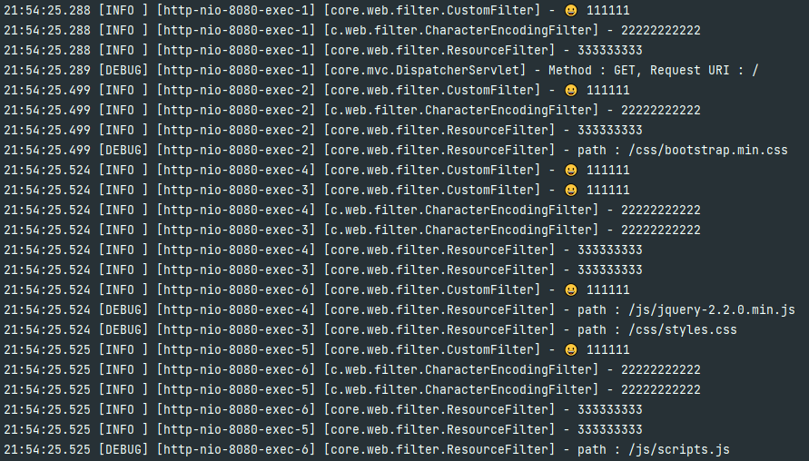
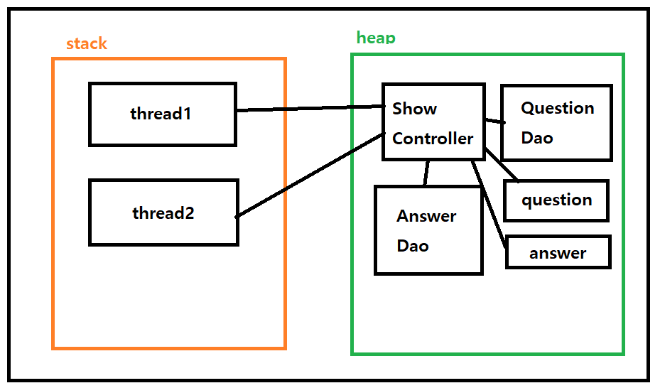
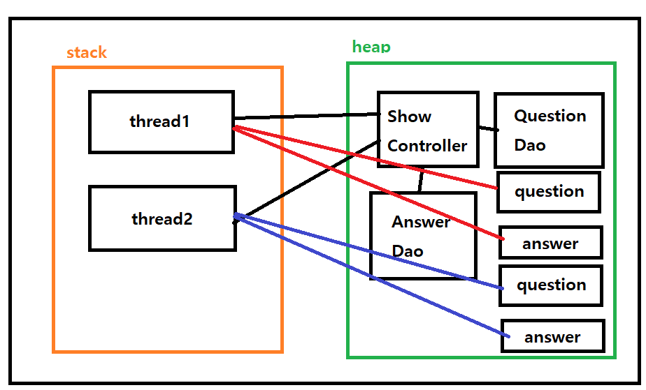
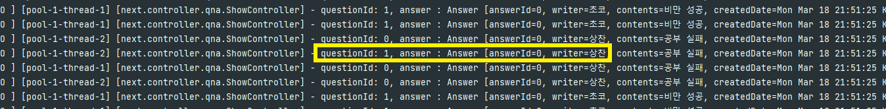

1. Tomcat 서버를 시작할 때 웹 애플리케이션이 초기화하는 과정을 설명하라.

톰캣의 포트와 webapp 경로를 설정하고 톰캣을 실행시킨다.

서블릿 컨테이너인 톰켓은 웹 애플리케이션의 상태를 관리하는 ServletContext를 생성한다.

ServletContext가 초기화되면 컨텍스트의 초기화 이벤트가 발생한다.

등록된 ServletContextListener의 콜백 메소드가 호출된다.

이때 contextInitialized() 메소드가 호출된다.

데이터베이스가 연결되고 테이블 및 데이터가 생성된다.

그 후에, DispatcherServlet의 loadOnStartup 설정에 의해 서블릿 컨테이너가 초기화되고 실행된다.

rm에 있는 url과 그에 따른 Controller가 저장되고 대기 상태에 있게 된다.


### ✅ RequestMapping의 rm은 initMapping() 이후에 GC의 대상이 되지 않나?

- rm같은 경우 static이 아닌 객체 생성을 통해 만들어진다. 사용이 되지 않는다면 GC의 대상이 되어 사라지지 않을까?
  - Tomcat은 서블릿 컨테이너로 다양한 서블릿의 생명 주기를 관장한다.
  - `/webapp` 안에 있는 서블릿을 탐색하고 서블릿 컨테이너에 등록한다.
  - 서블릿들은 컨테이너 안의 필드에 저장되어 있고, 컨테이너는 계속 실행되기 때문에 GC의 대상이 되지 않는다.
  - 😥 **Tomcat의 코드들을 따라가 보았지만 서블릿을 언제 찾고 어떻게 저장하는지는 확인하지 못했다.**

### ✅ ServletContextListener와 DispatcherServlet 중 어느 것이 먼저 호출될까?

- 서블릿 컨테이너 초기화 과정에서 `WebListener`가 서블릿 컨텍스트 이벤트를 수신한다.
- 반면 `DispatcherServlet`은 클라이언트의 요청을 받고 그에 따라 적절한 컨트롤러로 라우팅하는 역할을 하는데, loadOnStartup = 1의 설정으로 서블릿 컨테이너가 시작할 때 해당 서블릿이 초기화된다.
- 즉 순서는 ServletContextListener가 먼저 실행되고 그 다음에 DispatcherServlet 이 실행된다.

### ❓ Tomcat의 내부 로그 확인 실패

- 톰켓 내부에 동작하는 로직을 보기 위해 로그를 살펴보려고 했지만 확인하지 못했다.
- Springboot인 경우에는 `application.properties`의 톰캣 로그 설정을 바꿔줌으로써 확인할 수 있다.
- 또한, 임베디드 톰켓이 아닌 외부에서 톰켓을 돌리는 경우에는 `[톰캣 설치 폴더]\logs` 에서 확인할 수 있다.
- 결국 나는 또 한 번 패배를 맛 보았다.


#### 2. Tomcat 서버를 시작한 후 http://localhost:8080으로 접근시 호출 순서 및 흐름을 설명하라.

요청을 처리할 서블릿에 접근하기 전에 먼저 ResourceFilter와 CharacterEncodingFilter의 doFilter() 메소드가 실행된다. 

CharacterEncodingFilter에서 request와 response의 CharacterEncoding을 UTF-8로 설정한다.

ResourceFilter에서는 정적자원(js,css,images) 요청을 처리할지 확인 하는데 '/'는 속하지 않기 때문에 서블릿으로 요청을 위임한다.

모든 경로는 가장 먼저 DispatcherServlet의 service로 들어간다.

URL 경로를 받은 다음 RequestMapping 객체를 통해 URL에 맞는 Controller를 불러와서 작업을 처리한다.

루트 경로이므로 HomeController로 간다음 home.jsp를 실행하도록 한다.

질문에 대한 데이터도 함께 ModelAndView에 담겨서 넘겨오며 render를 통해 각 데이터가 request에 담겨 home.jsp로 전달된다.


### ✅ Filter  순서 설정

- 필터는 서블릿 사양의 일부로 정의되어 있고, 클라이언트로부터 오는 요청을 서블릿이 처리하기 전이나 서블릿이 응답을 클라이언트로 보내기 전에 특정 작업을 수행할 수 있다.
- 필터는 순서 설정이 가능하다.
  - 스프링부트인 경우 Bean을 등록하여 낮은 순서부터 먼저 실행되도록 만들 수 있다.

```java
import javax.servlet.*;
import java.io.IOException;

public class CustomFilter implements Filter {
    @Override
    public void init(FilterConfig filterConfig) throws ServletException {
        // 필터 초기화 로직
    }

    @Override
    public void doFilter(ServletRequest request, ServletResponse response, FilterChain chain)
            throws IOException, ServletException {
        // 요청 처리 전 로직
        System.out.println("요청 처리 전에 실행되는 로직");

        // 다음 필터로 요청을 전달, 끝나면 다시 돌아옴
        chain.doFilter(request, response);

        // 응답 처리 후 로직
        System.out.println("응답이 클라이언트로 가기 전에 실행되는 로직");
    }

    @Override
    public void destroy() {
        // 필터 종료 로직
    }
}
```

- 현재 애플리케이션 같은 경우 Spring-boot가 아닌 톰켓을 통한 서블릿 컨테이너를 사용하므로 수동으로 필터 등록이 필요하다.
- web.xml을 생성하고 WEB-INF 경로에 넣어준다.
  - filter는 등록된 순서대로 실행되도록 default 설정되어 있다.

```xml
<?xml version="1.0" encoding="UTF-8"?>
<web-app xmlns="http://xmlns.jcp.org/xml/ns/javaee"
         xmlns:xsi="http://www.w3.org/2001/XMLSchema-instance"
         xsi:schemaLocation="http://xmlns.jcp.org/xml/ns/javaee
                             http://xmlns.jcp.org/xml/ns/javaee/web-app_3_1.xsd"
         version="3.1">
    <filter>
        <filter-name>customFilter</filter-name>
        <filter-class>core.web.filter.CustomFilter</filter-class>
    </filter>
    <filter-mapping>
        <filter-name>customFilter</filter-name>
        <url-pattern>/*</url-pattern>
    </filter-mapping>

    <filter>
        <filter-name>characterEncodingFilter</filter-name>
        <filter-class>core.web.filter.CharacterEncodingFilter</filter-class>
    </filter>
    <filter-mapping>
        <filter-name>characterEncodingFilter</filter-name>
        <url-pattern>/*</url-pattern>
    </filter-mapping>
    <filter>
        <filter-name>resourceFilter</filter-name>
        <filter-class>core.web.filter.ResourceFilter</filter-class>
    </filter>
    <filter-mapping>
        <filter-name>resourceFilter</filter-name>
        <url-pattern>/*</url-pattern>
    </filter-mapping>
</web-app>

```

- 1, 2, 3 순서대로 필터가 실행되지만, 멀티쓰레드 환경에서 브라우저가 실행되기 때문에 몇몇은 겹쳐서 로그가 출력된다.



#### 7. next.web.qna package의 ShowController는 멀티 쓰레드 상황에서 문제가 발생하는 이유에 대해 설명하라.

* 서블릿 컨테이너는 서블릿 인스턴스를 하나 생성한 후 재사용한다. 즉 싱글톤 패턴을 활용한다. 서블릿 컨테이너는 멀티 쓰레드 환경에서 동작하게 되는데 이때 메모리 사용에 따라 문제가 발생하게 된다. 쓰레드는 기본적으로 힙 영역을 공유하는데  `Question`과 `List<Answer>`의 상태를 공유하게 된다. 만약, Thread1의 execute 동작이 끝나기 전에 Thread2의 execute가 동작하게 된다면 Thread1의 상태도 Thread2의 것으로 변경되어 문제가 생긴다
* ❓ **QuestionDao와 AnswerDao는 문제가 되지 않는 이유?**
  
  * ShowController 객체의 필드는 모두 Heap영역에 존재한다.
  * QuestionDao와 AnswerDao는 new를 통해 객체 하나를 생성하고 가지고 있으며 해당 객체만 활용한다.
  * question과 answer도 heap영역에 존재하는데 할당되는 값들이 계속 재할당되고 thread가 그 참조값을 바라 보고 있다.
  
  
  
  
* **❓ 지역 변수와 필드의 차이는?**

  * 지역 변수는 메소드 내에 있어서 스택 영역에 존재한다.
  * 필드는 클래스의 속성이므로 항상 Heap에 존재한다.

* **❓ 멀티 쓰레드 에러 검증을 위한 방법이 있나?**
  * 있구만...
  * 그리고 ThreadPool은 2개와 100개 중 어느 것이 에러 확률이 높을까?
    * 100개의 Thread가 변수에 많이 접근하기 때문에 에러 확률이 더 높다.


