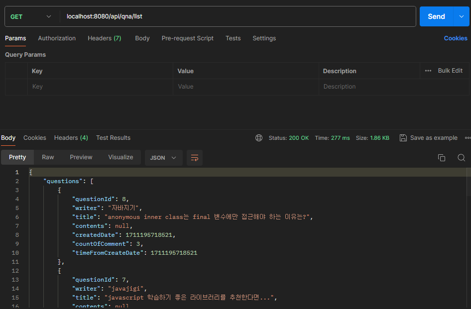
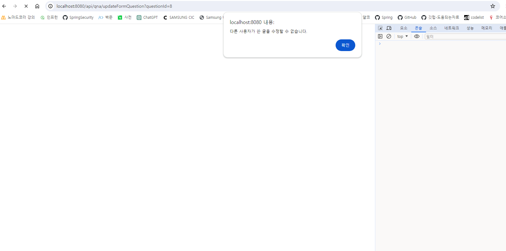
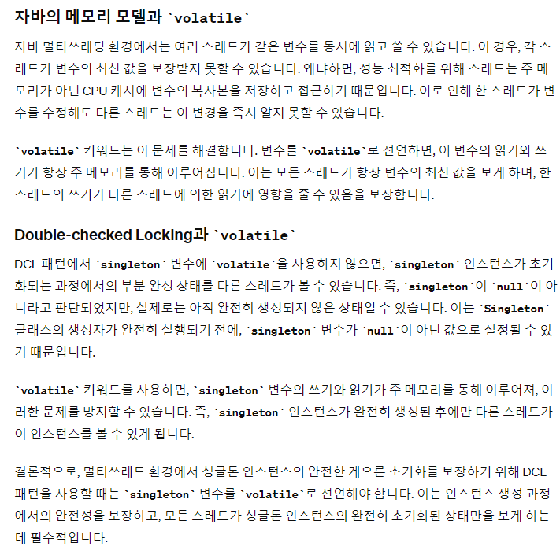

### 8번. 답변 추가 시 댓글 개수 1 증가하도록 변경

- DB는 반영
  - QuestionDao에 댓글 개수를 update하는 구문을 넣어야 한다.
- ✅ 페이지에 댓글 수 반영
  - AJAX 요청을 통해 해당 개수가 변하도록 `updateCountOfAnswer` 함수를 활용!

```js
function onSuccess(json, status){
  ...
  var countOfAnswer = json.countOfAnswer;
  updateCountOfAnswer(countOfAnswer);
}
function updateCountOfAnswer(count) {
    $(".qna-comment-count strong").text(count);
}
```

- ✅ 답변 입력 후 입력된 값들 모두 초기화
  - 현재 답변을 입력하고 나서 입력된 값이 그대로 남아있다.
  - input값을 value를 ""로 바꿔서 답변하기 버튼을 누르게 되면 값들이 사라지게 만든다.

```js
function onSuccess(json, status){
  var answer = json.answer;
  ...
  resetInputValue();
}

function resetInputValue() {
    $(".answerWrite input[type='text'], .answerWrite textarea").val("");
}
```

### 9. 질문 목록 JSON 데이털 조회할 수 있도록 구현

```java
public class QuestionListController extends AbstractController {
    private final QuestionDao questionDao = new QuestionDao();
    @Override
    public ModelAndView execute(HttpServletRequest request, HttpServletResponse response) throws Exception {

        List<Question> questions = questionDao.findAll();
        return jsonView().addObject("questions", questions);
    }
}
```



### 10. 답변 삭제하기 기능 구현

- DB에서 Answer가 제거된다.
- 페이지에서 전체 의견 개수가 감소한다.
- DB에서 countOfAnswer의 개수가 감소한다. → questionId를 넘겨줘서 감소시킴. sql문도 변화

```js
$(".article-util button[type=submit]").click(deleteAnswer);

function deleteAnswer(e) {
    e.preventDefault();

    var article = $(this).closest("article");
    article.remove();

    var countOfAnswer = $(".qna-comment-count strong").text();
    $(".qna-comment-count strong").text(countOfAnswer - 1);

    var form = $(this).closest("form");
    var answerId = form.find("input[name='answerId']").val();

    $.ajax({
        type: 'post',
        url: '/api/qna/deleteAnswer',
        data: {answerId : answerId},
        dataType: 'json',
        error: function(xhr, status) {
            alert("error");
        },
        success: function(json, status) {
            console.log("article 삭제");
            console.log(json.result.status);
        }
    })
}
```

```java
// questionDao.updateCountOfAnswer(questionId, 1); 1 추가할 경우
// questionDao.updateCountOfAnswer(questionId, -1); 1 감소할 경우

public void updateCountOfAnswer(Long questionId, int cnt) {
        JdbcTemplate jdbcTemplate = new JdbcTemplate();
        String sql = "UPDATE QUESTIONS " +
                "SET countOfAnswer = countOfAnswer + ?" +
                "WHERE questionId = ?";
        jdbcTemplate.update(sql, cnt, questionId);
    }
```

### 11. 질문 수정

- 로그인 여부 판단, 동일 사용자 여부 판단 진행

```java
public class UpdateFormQuestionController extends AbstractController {
    private final QuestionDao questionDao = new QuestionDao();

    @Override
    public ModelAndView execute(HttpServletRequest request, HttpServletResponse response) throws Exception {
        HttpSession session = request.getSession();
        if (!UserSessionUtils.isLogined(session)) {
            return jspView("redirect:/users/loginForm");
        }

        long questionId = Long.parseLong(request.getParameter("questionId"));
        Question question = questionDao.findById(questionId);
        User user = UserSessionUtils.getUserFromSession(session);
        System.out.println(user);
        if (!question.isSameUser(user)) {
            throw new IllegalStateException("다른 사용자가 쓴 글을 수정할 수 없습니다.");
        }
        return jspView("/qna/update.jsp").addObject("question", question);
    }
}
```

- ✅ 동일한 유저가 아닌 경우는 에러창 발생 후 이전 페이지로 복귀

```jsp
<%@ page contentType="text/html;charset=UTF-8" language="java" %>
<html>
<head>
    <title>Error Handling</title>
    <script>
        window.onload = function() {
         var errorMessage = "<%= request.getAttribute("errorMessage").toString() %>";
            alert(errorMessage);
            window.history.back(); // 사용자를 이전 페이지로 이동
        };
    </script>
</head>
<body>
</body>
</html>
```



- ✅ 수정하기 버튼을 눌렸을 때 자연스럽게 show.jsp로 이동하도록 redirect 진행(use case 고려)

```java
public class UpdateQuestionController extends AbstractController {
    private QuestionDao questionDao = new QuestionDao();

    @Override
    public ModelAndView execute(HttpServletRequest request, HttpServletResponse response) throws Exception {
        long questionId = Long.parseLong(request.getParameter("questionId"));
        String title = request.getParameter("title");
        String contents = request.getParameter("contents");
        questionDao.update(title, contents, questionId);
        return jspView("redirect:/qna/show?questionId=" + questionId);
    }
}
```

### 12. 싱글톤 패턴 생성

- 클래스가 로드되는 시점에 단 한번만 인스턴스가 생성되고, 그 인스턴스를 재사용한다.
  - JVM이 해당 클래스를 메모리에 로드하는 순간 생성된다.

```java
public class Singleton {
    private static final Singleton singleton = new Singleton();

    private Singleton() {
    }

    public static Singleton getInstance() {
        return singleton;
    }
}
```

- 💥 아래 코드는 멀티 쓰레드 환경에서 문제가 발생한다.
  - 여러 인스턴스가 생성될 위험이 존재한다.

```java
public class Singleton {
    private static Singleton singleton;

    private Singleton() {
    }

    public static Singleton getInstance() {
        if (singleton == null) {
            singleton = new Singleton();
        }
        return singleton;
    }
}
```

- 📌 Double-checked Locking(DCL) 사용하기

```java
public class Singleton {
    private static Singleton singleton;

    private Singleton() {
    }

    public static Singleton getInstance() {
        if (singleton == null) {
            synchronized (Singleton.class) {
                if (singleton == null) {
                    singleton = new Singleton();
                }
            }
        }
        return singleton;
    }
}

```



### 13. 질문을 삭제하는 코드 작성

- ApiDeleteQuestionContorller와 DeleteQuestionController의 중복되는 부분을 상속이 아닌 조합(Composition)을 활용해 구한다.
- MVC 패턴이 생성되는 것을 확인할 수 있다.

### 14. DI패턴으로 만들어 테스트 용이한 코드로 변경

- 💥 public으로 접근 제한자를 변경하고 생성자 주입을 만들어주면 되나?

```java

public class QnaService {
    private static final QnaService qnaService = new QnaService(QuestionDao.getInstance(), AnswerDao.getInstance());

    private final QuestionDao questionDao;
    private final AnswerDao answerDao;

    public QnaService(QuestionDao questionDao, AnswerDao answerDao) {
        this.questionDao = questionDao;
        this.answerDao = answerDao;
    }

    public static QnaService getInstance() {
        return qnaService;
    }
```

- 💥 void타입으로 return할 경우에는 평가가 까다롭다. 어떻게 해결하는 게 좋을까?
  - 해당 로직에서 원하는 메소드가 몇 번 호출되었는지로 판단하는 코드를 작성했다.

```java
@Test
void 답변이_비었을_경우() throws CannotDeleteException {
    //given
    long questionId = 1L;
    Question question = new Question("user", "title", "contents");
    User user = new User("user", "password", "name", "email");
    //when
    when(questionDao.findById(questionId)).thenReturn(question);
    when(answerDao.findAllByQuestionId(questionId)).thenReturn(null);
    qnaService.deleteQuestion(1L, user);
    // then
    verify(questionDao).delete(questionId);
    verify(answerDao, never()).deleteAllByQuestionId(questionId);
}
```

- 💥 ViewName을 가져올 수 없다.
  - Controller는 어떻게 테스트를 진행해야하나?

```java

@ExtendWith(MockitoExtension.class)
public class DeleteQuestionControllerTest {

    DeleteQuestionController deleteQuestionController;

    @Mock
    HttpServletRequest request;

    @Mock
    HttpServletResponse response;

    @Mock
    HttpSession httpSession;

    @BeforeEach
    void setup() {
        deleteQuestionController = new DeleteQuestionController();
        MockitoAnnotations.openMocks(this);
        User user = new User("user", "password", "name", "email");
        httpSession = new MockHttpSession();
        httpSession.setAttribute(UserSessionUtils.USER_SESSION_KEY, user);
    }

    @Test
    public void testDeleteQuestionNotLoggedIn() throws Exception {
        // given
        httpSession = new MockHttpSession();
        when(request.getSession()).thenReturn(httpSession);
        when(request.getParameter("questionId")).thenReturn("1");

        // when
        ModelAndView mv = deleteQuestionController.execute(request, response);

        // then
//        Assertions.assertThat("redirect:/users/loginForm").isEqualTo(mv.getView());

    }
}
```

